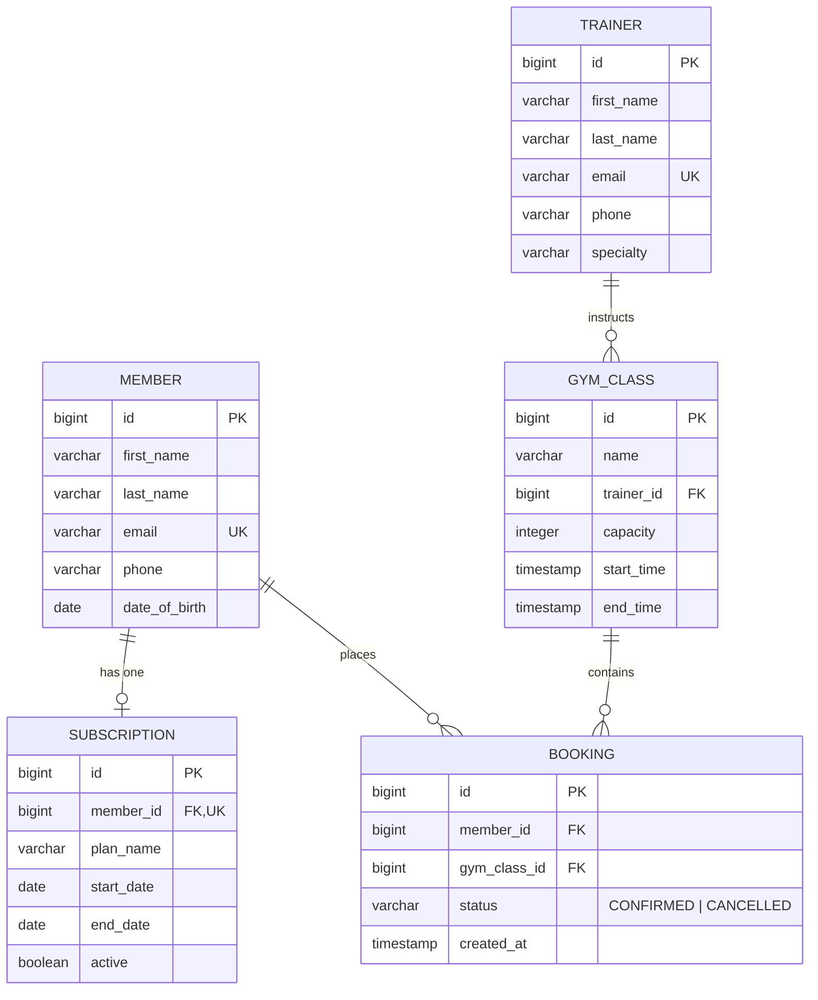

# Gym Management System API

[](https://www.oracle.com/java/)
[](https://spring.io/projects/spring-boot)
[](https://www.postgresql.org/)
[](https://flywaydb.org/)
[](https://www.docker.com/)
[](https://junit.org/junit5/)

A production-ready RESTful backend service built with **Spring Boot 3.3** and **Java 21** for managing gym memberships, personal trainers, scheduled group classes, and automated booking capacity enforcement.

---

## Table of Contents
- [Overview](#overview)
- [Key Features and Business Rules](#key-features-and-business-rules)
- [Architecture and Tech Stack](#architecture-and-tech-stack)
- [Domain Model and Entity Relationships](#domain-model-and-entity-relationships)
- [Getting Started](#getting-started)
  - [Run with Docker Compose (Recommended)](#1-run-with-docker-compose-recommended)
  - [Run Locally with Maven](#2-run-locally-with-maven)
- [REST API Reference](#rest-api-reference)
- [cURL Verification Workflow](#curl-verification-workflow)
- [Automated Testing](#automated-testing)
- [Future Roadmap (v2.0)](#future-roadmap-v20)

---

## Overview

The **Gym Management System** provides an enterprise-structured API layer designed around modern software engineering standards. It enforces:
* **Clean Layered Architecture** (`Controller` -> `Service` -> `Repository` -> `Entity`).
* **Contract Decoupling** with **Java 21 Records** as immutable Data Transfer Objects (DTOs).
* **Database Schema Versioning** via **Flyway** migrations.
* **Strict Domain Validation** and standardized error payloads via a centralized `@RestControllerAdvice`.
* **Container Security** via a multi-stage `Dockerfile` executed by a non-root system user.

---

## Key Features and Business Rules

1. **Member and Trainer Management**:
   - Full CRUD operations with format validation (`@Email`, `@NotBlank`, `@Past`).
   - Unique email enforcement returning `409 Conflict` on duplicate attempts.
   - Filter trainers dynamically by specialty (`GET /api/trainers?specialty=CrossFit`).

2. **Subscription Lifecycle**:
   - Strict date range integrity (`endDate` must be on or after `startDate`).
   - One active subscription per member constraint.

3. **Gym Class Scheduling**:
   - Enforces valid scheduling window (`endTime` must be strictly after `startTime`).
   - Filter upcoming classes relative to the current timestamp (`GET /api/classes/upcoming`).

4. **Booking Engine and Capacity Enforcement** (Core Domain Rule):
   - **Capacity Check**: Prevents overbooking beyond class capacity. If confirmed bookings reach capacity, the service throws `ClassFullException` which maps cleanly to `HTTP 409 Conflict`.
   - **Duplicate Prevention**: A member cannot book the same class twice if they already have an active (`CONFIRMED`) booking.
   - **Soft Cancellation**: Bookings are marked as `CANCELLED` rather than deleted, preserving audit and historical data while immediately freeing up capacity.

---

## Architecture and Tech Stack

| Layer / Tool | Technology | Purpose |
| :--- | :--- | :--- |
| **Language** | **Java 21 (LTS)** | Records (DTOs), Pattern Matching, Modern Collections |
| **Framework** | **Spring Boot 3.3.4** | Core DI container, Spring MVC REST Controllers |
| **Persistence** | **Spring Data JPA / Hibernate** | Repository pattern, Object-Relational Mapping |
| **Validation** | **Jakarta Bean Validation** | Declarative DTO validation constraints |
| **Database** | **PostgreSQL 16** | Relational data persistence with Foreign Keys and Indexes |
| **Migrations** | **Flyway** | Version-controlled, reproducible SQL schema migrations |
| **Testing** | **JUnit 5 & Mockito** | Isolated unit testing of core business domain rules |
| **Containerization**| **Docker & Docker Compose** | Multi-stage builder & lightweight Temurin 21 JRE runtime |

---

## Domain Model and Entity Relationships



---

## Getting Started

### 1. Run with Docker Compose (Recommended)

Ensure you have **Docker** and **Docker Compose** installed.

Clone the repository and run:
```bash
docker compose up --build -d
```

* **Application API**: `http://localhost:8081`
* **PostgreSQL Database**: `localhost:5432` (`gym_db` / `postgres` / `postgrespassword`)

To check application logs:
```bash
docker compose logs -f app
```

To stop all services:
```bash
docker compose down
```

---

### 2. Run Locally with Maven

**Prerequisites**: Java 21 JDK, Maven 3.9+, PostgreSQL running locally on port 5432.

1. Start PostgreSQL with Docker:
   ```bash
   docker compose up -d postgres
   ```
2. Build and run the Spring Boot application:
   ```bash
   mvn clean spring-boot:run
   ```

---

## REST API Reference

### Members (`/api/members`)
| Method | Endpoint | Description | Status Code |
| :--- | :--- | :--- | :--- |
| `POST` | `/api/members` | Register a new member | `201 Created` |
| `GET` | `/api/members` | Get all members | `200 OK` |
| `GET` | `/api/members/{id}` | Get member by ID | `200 OK` |
| `PUT` | `/api/members/{id}` | Update member profile | `200 OK` |
| `DELETE`| `/api/members/{id}` | Delete member (cascades subscriptions/bookings) | `204 No Content` |

### Trainers (`/api/trainers`)
| Method | Endpoint | Description | Status Code |
| :--- | :--- | :--- | :--- |
| `POST` | `/api/trainers` | Register a new trainer | `201 Created` |
| `GET` | `/api/trainers` | List all trainers (Optional `?specialty=Yoga`) | `200 OK` |
| `GET` | `/api/trainers/{id}` | Get trainer by ID | `200 OK` |
| `PUT` | `/api/trainers/{id}` | Update trainer details | `200 OK` |
| `DELETE`| `/api/trainers/{id}` | Delete trainer (fails if classes assigned) | `204 No Content` |

### Subscriptions (`/api/subscriptions`)
| Method | Endpoint | Description | Status Code |
| :--- | :--- | :--- | :--- |
| `POST` | `/api/subscriptions` | Assign subscription to member | `201 Created` |
| `GET` | `/api/subscriptions/{id}` | Get subscription by ID | `200 OK` |
| `GET` | `/api/subscriptions/member/{memberId}` | Get subscription for member | `200 OK` |
| `DELETE`| `/api/subscriptions/{id}` | Cancel/delete subscription | `204 No Content` |

### Gym Classes (`/api/classes`)
| Method | Endpoint | Description | Status Code |
| :--- | :--- | :--- | :--- |
| `POST` | `/api/classes` | Schedule a new class | `201 Created` |
| `GET` | `/api/classes` | List all scheduled classes | `200 OK` |
| `GET` | `/api/classes/{id}` | Get class details | `200 OK` |
| `GET` | `/api/classes/upcoming` | List upcoming classes from now | `200 OK` |

### Bookings (`/api/bookings`)
| Method | Endpoint | Description | Status Code |
| :--- | :--- | :--- | :--- |
| `POST` | `/api/bookings` | Book a class (enforces capacity) | `201 Created` / `409 Conflict` |
| `GET` | `/api/bookings/{id}` | Get booking details | `200 OK` |
| `GET` | `/api/bookings/member/{memberId}` | Get all bookings for a member | `200 OK` |
| `GET` | `/api/bookings/class/{classId}` | Get all bookings for a class | `200 OK` |
| `PATCH`| `/api/bookings/{id}/cancel` | Soft cancel booking (frees capacity) | `200 OK` |

---

## cURL Verification Workflow

Test the complete flow in your terminal:

```bash
# 1. Register a Member
curl -X POST http://localhost:8081/api/members \
  -H "Content-Type: application/json" \
  -d '{"firstName":"Alex","lastName":"Papadopoulos","email":"alex@example.com","phone":"6900000001","dateOfBirth":"1995-05-12"}'

# 2. Register a Trainer
curl -X POST http://localhost:8081/api/trainers \
  -H "Content-Type: application/json" \
  -d '{"firstName":"Maria","lastName":"Oikonomou","email":"maria@example.com","phone":"6900000002","specialty":"Pilates"}'

# 3. Schedule a Group Class (Capacity: 1)
curl -X POST http://localhost:8081/api/classes \
  -H "Content-Type: application/json" \
  -d '{"name":"Morning Pilates","trainerId":1,"capacity":1,"startTime":"2026-10-01T09:00:00","endTime":"2026-10-01T10:00:00"}'

# 4. Book the class (Success: 201 Created)
curl -X POST http://localhost:8081/api/bookings \
  -H "Content-Type: application/json" \
  -d '{"memberId":1,"gymClassId":1}'

# 5. Attempt a duplicate or over-capacity booking (Expect: 409 Conflict)
curl -i -X POST http://localhost:8081/api/bookings \
  -H "Content-Type: application/json" \
  -d '{"memberId":1,"gymClassId":1}'

# 6. Cancel the Booking (Frees up capacity)
curl -X PATCH http://localhost:8081/api/bookings/1/cancel
```

---

## Automated Testing

Business rules are covered with isolated unit tests using **JUnit 5** and **Mockito**:

```bash
mvn test
```

Key unit test scenarios covered in [`BookingServiceTest`](src/test/java/com/gym/service/BookingServiceTest.java):
* **Happy Path Booking**: Successfully verifies member and class existence, confirms capacity availability, and persists booking with `BookingStatus.CONFIRMED`.
* **Class Full Constraint (409 Conflict)**: Asserts that when confirmed bookings reach the class limit, `ClassFullException` is thrown and no booking is created.
* **Duplicate Booking Prevention (409 Conflict)**: Throws `DuplicateResourceException` when a member re-books an active class.
* **Soft Cancellation**: Transitions booking status to `CANCELLED`.
* **Idempotency on Cancellation**: Throws `InvalidOperationException` if attempting to cancel an already cancelled booking.

---

## Future Roadmap (v2.0)

- [ ] **Spring Security 6 & JWT**: Stateless token-based authentication with role-based access control (`ROLE_ADMIN`, `ROLE_MEMBER`).
- [ ] **Redis In-Memory Caching**: Cache upcoming classes (`@Cacheable`) with eviction on updates (`@CacheEvict`) for low-latency reads.
